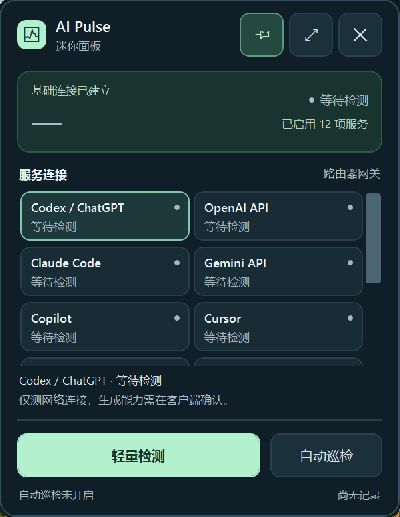

# AI Pulse

[English](README.en.md) · **1.2.0-experimental.1** · Windows x64 · 中文界面

一个用 **vibe coding** 做出来的 AI 连通性小工具。网络忽好忽坏时，打开它看看各个服务的连接情况；也可以把迷你面板挂在副屏，安静地留意变化。

支持 Codex / ChatGPT、Claude、Gemini、Copilot、Cursor、DeepSeek 和 OpenRouter 等入口。完整面板提供分阶段耗时、历史趋势和导出；迷你模式可拖动、缩放、置顶，并记住窗口位置。

## 下载与开始

1. 在 [本版本下载页](https://github.com/miaomiao-tools/miaomiao-tools/releases/tag/mm-002-v1.2.0-experimental.1) 下载 `AIPulse-1.2.0-experimental.1-win-x64.zip`。
2. **完整解压**到自己可写的新文件夹，双击 `AI Pulse.exe`。适用于 Windows 10 / 11 x64，已包含 .NET 8.0.31，无需另装运行时。
3. 点击「轻量检测」。想挂在副屏，点击「迷你模式」或按 **Ctrl+M**；需要持续观察时再开启「自动巡检」。每次启动时自动巡检默认关闭。

**升级已有版本：**先正常退出旧程序，保留并复制原来的整个 `data` 文件夹到新程序旁边，再打开新版本。设置、历史、冷却记录和窗口偏好都在其中。新文件夹不会自动继承旧版冷却；不要通过删数据或换文件夹跳过保护期。程序实行全局单实例。

## 它能告诉你什么

日常检测检查 DNS、TCP 与 TLS 连接，不发送目标网页 HTTP 请求。需要进一步确认时，可在完整面板里手动检查一个服务的 HTTP 响应；不登录、不带 API Key、不调用付费模型。

**连通不等于模型可用。** 它不验证账号、订阅、地区权限、Codex 会话、流式生成或完整 agent 工作流。401、403、404 等响应会分别说明，不能仅凭一个响应认定出口被封。检测有间隔、退避和持久冷却，但无法保证绝不会触发服务方风控。

这是一个实验版，欢迎把真实使用中的问题带到 [Issues](https://github.com/miaomiao-tools/miaomiao-tools/issues)。提交前请遮住自己的地址和网络信息。上方插画用于装饰，不是网络实测截图。

首次启动的真实迷你界面，尚未检测，不代表各服务可用。

[使用说明](docs/USAGE.md) · [隐私与本地数据](docs/PRIVACY.md) · [许可与第三方组件](docs/NOTICE.md)

项目自有代码与素材采用 [MIT](LICENSE)。源代码包 `AIPulse-1.2.0-experimental.1-source.zip` 内含独立构建说明与脚本。
