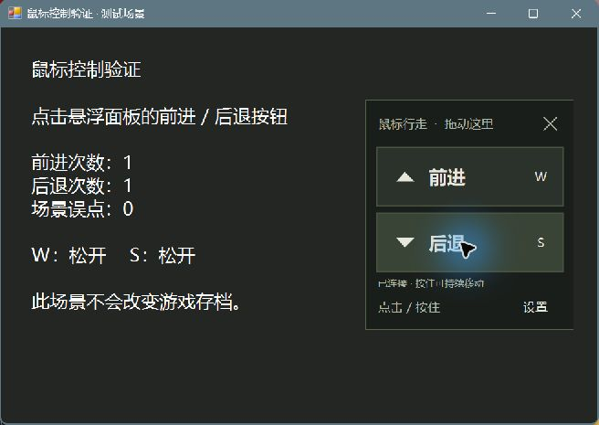

# 🍄 蘑菇鼠标助手

**中文** · [English](README.en.md)

用 **vibe coding** 为《Shroom and Gloom》补上鼠标 **前进 / 后退** 按钮。只负责 W / S，其余操作仍由游戏提供。

**Windows 10 / 11 x64 · .NET Framework 4.8 / 4.8.1 · 免费 · MIT**

**0.1.0-experimental.3 · 实验版**。面板重新站到游戏前面，游戏搬家后也能重新选择啦。

[下载 Windows ZIP（.3）](https://github.com/miaomiao-tools/miaomiao-tools/releases/download/mm-001-v0.1.0-experimental.3/ShroomMouse-0.1.0-experimental.3-win-x64.zip) · [发布页](https://github.com/miaomiao-tools/miaomiao-tools/releases/tag/mm-001-v0.1.0-experimental.3) · [问题反馈](https://github.com/miaomiao-tools/miaomiao-tools/issues)

## 开始使用

1. **完整解压**到自己的文件夹，再双击 `蘑菇鼠标助手.exe`；不要直接在压缩软件中运行。
2. 首次选择已安装游戏的 `Shroom and Gloom.exe`；可用 Steam「浏览本地文件」找到它。取消即退出。
3. 启动游戏、切回游戏窗口。点击「前进 / 后退」短按 W / S，按住持续移动。松开或移出按钮停止；切到其他软件也会释放。
4. 用完点面板 **×**，或通知区绿色双箭头菜单「退出助手」。

**升级**：先正常退出旧助手，再把新版完整解压到新文件夹。想保留游戏位置和布局，可将旧文件夹的 `game-path.txt`、`controls.ini` 复制到新文件夹，仅保留在自己电脑上，不要随文件夹一起分享。

拖动顶部移动面板；「设置」调整大小、透明度或 **重新选择游戏…**。选择前会停止移动；取消、选错或保存失败保留原游戏。看不到面板时，用通知区「显示 / 调整按钮」或「重置位置和大小」。

截图是实际运行的助手测试窗口，**不是游戏画面，也不代表游戏实测**。程序界面目前为中文。

短点击约 0.1 秒；连续按住 30 秒会自动释放，松开重按可继续。实验版，独占全屏和不同环境可能影响显示或输入。需要自行安装游戏；本工具无官方关联，不包含游戏或补丁，不修改游戏文件和存档。

当前机器的真实游戏中，已确认面板显示；用户确认前后退及松开、移出按钮后停止正常。其他环境及长时间按住等场景仍待验证。

[使用细节与恢复](docs/USAGE.md) · [MIT 许可](LICENSE) · [来源与第三方说明](docs/NOTICE.md)

由 **miaomiao tools** 制作。小工具，慢慢长大 🌱

[历史版本 .1](https://github.com/miaomiao-tools/miaomiao-tools/releases/tag/mm-001-v0.1.0-experimental.1)
